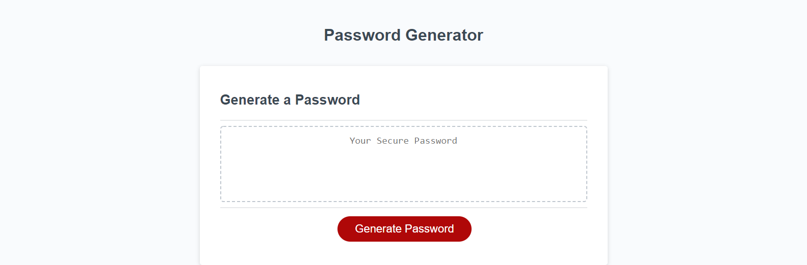

# 03 JavaScript: Password Generator

## Description
For this homework assignment, I was tasked with finishing the Javascript code for a random password generator.

## Solution

I originally started by creating if statements checking the users inputs to the prompts. After collaborating with peers, I understood I needed to create concatenating strings if the user selects yes, and create concatenating empty strings if the user selects no.

Once I successfully figured that out, I turned that concatenated array into a string, and created a for loop to select a random character in that string of concatenated characters. Then, I had to concatenate that random character into a stored variable to create the random password, and repeated that for loop a number of times specified by the users input. 

## Links

[Live Webpage](https://mli2950.github.io/Homework3/)  
[My Repository](https://github.com/mli2950/Homework3)

## Screenshot

